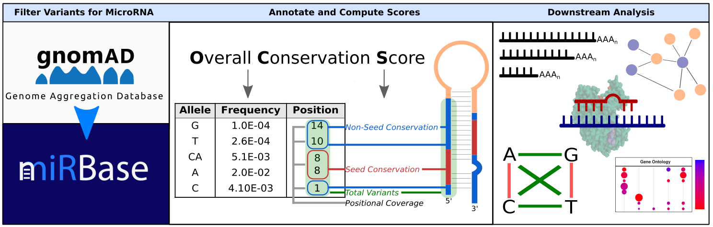

# Population-scale analysis of microRNA conservation using genomic variants

This repository contains the full analysis pipeline and datasets for the manuscript  
**"A Genomic Approach to Scoring microRNA Conservation in Humans"**.  
We introduce a novel scoring framework for assessing microRNA (miRNA) conservation across the human population using gnomAD v4 variant data. The analysis explores the relationship between miRNA conservation, expression, targeting dynamics, alternative polyadenylation, and population-specific variation.

## Overview

The project includes scripts for data processing, conservation score optimization, miRNA expression analysis, variant characterization, functional enrichment, and visualization. All scripts and datasets are organized to reproduce the results and figures in the manuscript.

## Code Descriptions

**01_download_gnomad.sh**  
Downloads joint variant data from gnomAD v4.0 (WGS and WES) for human genomes.

**02_filter_gnomad.sh**  
Filters gnomAD variants to retain those mapped to mature and precursor miRNAs defined in miRBase.

**03_weight_optimization.R**  
Computes the optimal weights for the Overall Conservation Score (OCS), maximizing the overlap between conservation and expression based on GTEx and miRNATissueAtlas2 data.

**04_variants.R**  
Characterizes miRNA variants and reproduces Figure 1a–g, including allele frequency distributions, InDel and Ti/Tv ratios, and population comparisons.

**05_expression_conservation.R**  
Reproduces Figure 3a–c. Analyzes OCS correlation with TCGA miRNA expression, conservation differences between 3p and 5p arms, and target site overlap.

**06_alternative_polyadenylation.R**  
Reproduces Figure 3d–e. Investigates the relationship between APA site usage and miRNA conservation in target genes.

**07_functional_enrichment.R**  
Performs enrichment analysis on highly conserved and poorly conserved miRNAs using MiEAA 2.0. Outputs GO terms, pathways, and disease associations.

**08_target_alignment.R**  
Aligns miRNA seed sequences to 3′ UTRs of genes to detect perfect seed matches, forming the basis for compensatory variant analysis.

**09_compensatory_variants.R**  
Identifies compensatory variant pairs in which both the miRNA and its target co-mutate to preserve base-pairing. Includes population-specific analysis.

**10_circos.R**  
Generates a Circos plot (Figure 3h) visualizing compensatory variant pairs across chromosomes, highlighting co-evolutionary patterns.

## Data Folder

The `data/` directory contains all necessary datasets for running the pipeline and reproducing the results:

**genomic_variants.csv**  
Filtered gnomAD v4.0 variants mapped to mature and precursor miRNAs (miRBase coordinates).

**mirna_variants_ocs.csv**  
Same as above, with an added column reporting the Overall Conservation Score (OCS) for each miRNA.

**genomic_binding_sites.csv**  
Results of miRNA seed alignment to 3′ UTRs of target genes, identifying perfect 6-mer matches.

**compensatory_pairs.csv**  
Population-specific compensatory variant pairs with annotations for allele frequency and conservation.

**mirna_seed.fasta**  
FASTA file containing miRNA seed sequences used for alignment against 3′ UTR regions.

**validated_interactions.csv**  
Experimentally validated miRNA–target gene pairs used to constrain alignment and interaction analyses.

## Contact

For questions please contact:  
**mercihan@uni-mainz.de** or **enrique.morett@ibt.unam.mx**

